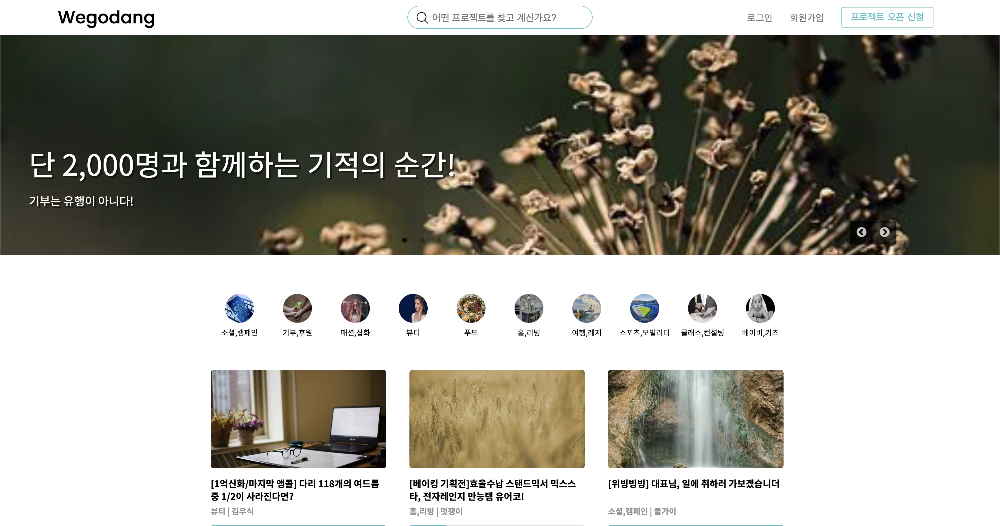
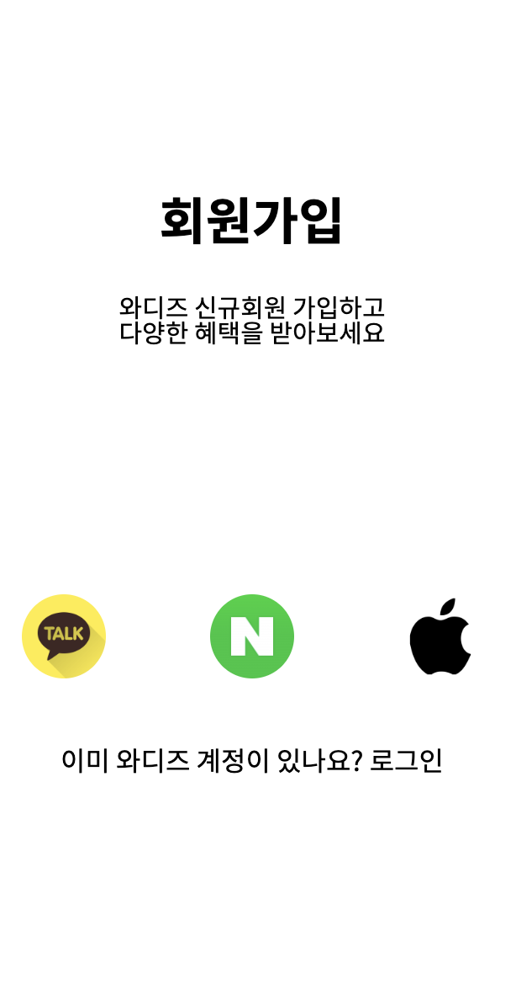
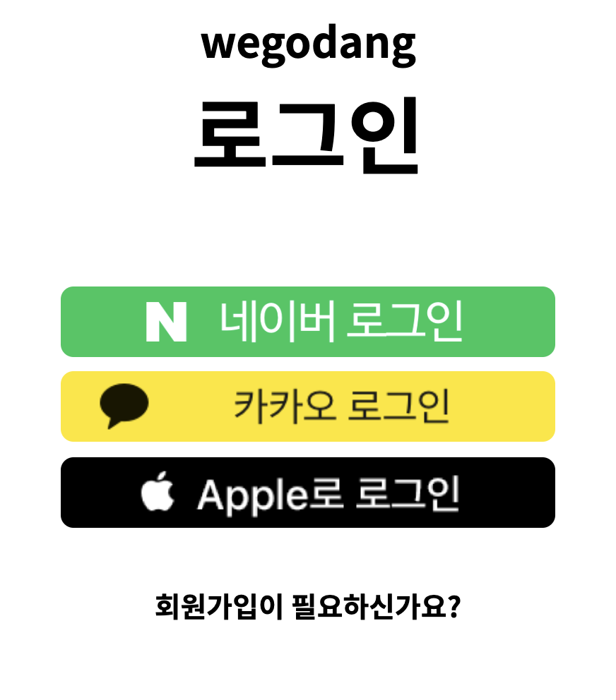
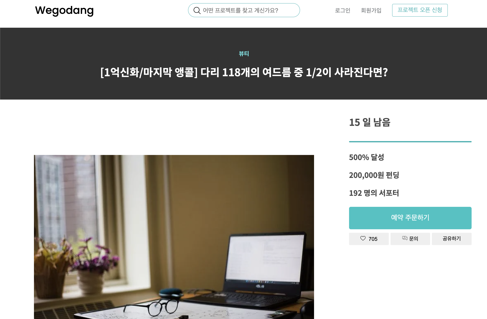

# Wegodang Client Project

## 🌟 What is project Goal

- 외부 라이브러리의 사용 방식( 문서읽는 법, 적용 방법 등...)을 익히는것을 최대한의 목표로 선정!
- OAuth2.0 Kakao 인증.인가방식 적용!!
- React 심화 과정인 custom hook을 이용하여 React 다운 프로젝트를 작성!!!

## 🌟 Wegodang Project Family

- F.E 
  [서한샘](https://github.com/kor-sams-dev)
  [최재혁](https://github.com/chlwogur31)
  [안중영](https://github.com/Ahnjungyoung)
   
- B.E 
  [김우식](https://github.com/Kws1995)

 

## 🌟개발 인원 및 기간

- 개발기간 2022/07/04 ~ 2022/07/15
- 개발 인원 프론트엔드 3명, 백엔드 1명

## 🌟 적용 기술 및 구현 기능

### 적용 기술

      

 

### 사용 라이브러리

- `styled-components`
- `qs`
- `react-slick`
- `recoil`
- `redux`
- `axios`

 

### 사용 폰트

- Poppins
  - 사용법 : `font-family: 'Poppins', sans-serif;`
  - font-weight : `500`
- Noto Sans Korean
  - 사용법 : `font-family: 'Noto Sans KR', sans-serif;`
  - font-weight : `400`, `700`

 

## 🌟 구현 페이지

 

### 메인 화면

## 

#### 적용기술

- react slick  
  react slick 라이브러리를 사용하여 carousel과 categories를 구현함
- 재사용  
  categories, itemCard 등과 같이 중복되는 컴포넌트를 분리하여 재사용성을 높임
- 무한 스크롤  
  스크롤을 맨 아래로 내리면 새로운 데이터를 받아와 표현하도록 작업

 

### 회원가입, 로그인

##  

#### 적용 기술

- OAuth2.0 
  카카오 REST API 방식을 이용하여 카카오 server와 통신  
  B/E와 통신하여 AccessToken을 받아오도록 작업

 

### 상세페이지

#### 적용 기술

- 반응형 웹 디자인을 구현함
- 동적 라우팅을 이용하여 상세 페이지를 동적으로 구현함
- custom hook을 사용하여 데이터 통신을 구현함
